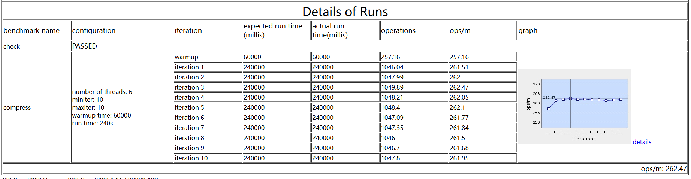

# 2024 ZJU Summer Camp：Performance Measurement, Evaluation and Analysis

The configuration of the machine for testing:

CPU : 6 × Intel(R) Xeon(R) CPU E5-2680 v4 @ 2.40GHz

GPU: NVIDIA RTX A2000

RAM: 30GB

OS: Ubuntu 20.04.3 LTS

## Assignment 1: Software Performance Measurement

1. Download the software SPECjvm2008

   link：[SPECjvm2008](https://www.spec.org/jvm2008/#tdsub)

2. Build Java environment（on linux）

   download jdk:

   ```
   sudo apt-get update
   sudo apt install openjdk-8-jdk-headless
   ```

   set up environment:

   ```
   cd /usr/lib/jvm
   vim ~/.zshrc
   ```

   in ~/.zshrc:

   ```
   export JAVA_HOME=/usr/lib/jvm/java-8-openjdk-amd64
   export PATH=$JAVA_HOME/bin:$PATH
   ```

   ````
   source ~/.zshrc
   ````

   use `java -version` in terminal to check whether java is available

   **tips**: 

   make sure that  `JAVA_HOME=/usr/lib/jvm/java-8-openjdk-amd64/` rather than `JAVA_HOME=/usr/lib/jvm/java-8-openjdk-amd64/bin/java`

3. Install SPECjvm2008

   ```
   java -jar SPECjvm2008_1_01_setup.jar -i console
   ```

   follow the instructions in the terminal to finish installation

   **tips**: 

   only Java 8 or lower is able to run the command, otherwise you may get an error of unable to read the jre file, so make sure your Java version is under 8

4. Run the Benchmark
    cd to the SPEC directory

  ```
  java -jar SPECjvm2008.jar startup.helloworld  startup.compress startup.crypto.aes startup.crypto.rsa startup.crypto.signverify startup.mpegaudio startup.scimark.fft startup.scimark.lu startup.scimark.monte_carlo startup.scimark.sor startup.scimark.sparse startup.serial startup.sunflow startup.xml.validation  compress crypto.aes crypto.rsa crypto.signverify mpegaudio scimark.fft.large scimark.lu.large scimark.sor.large scimark.sparse.large scimark.fft.small scimark.lu.small scimark.sor.small scimark.sparse.small scimark.monte_carlo serial sunflow xml.validation
  ```

   the results:

  

  **tips**: 

- many failure cases occurred in this process. The `startup.compiler.sunflow` is unable to  run. According to the official document, this is due to Java SE 8

  

  In order the solve the problem, one way is to modify the `Main.java` file, however, as I tried, this didn't work. 

- To fix the problem, I also tried to use Java SE 7 and Java SE 6 to run the benchmark. Unfortunately, though these two versions successfully passed the `sunflow` test, they failed in `startup.xml.transform` later. So the solution was to simply skip these 4 tests. The results of Java SE 7 and Java SE 6 are as follows:

Java SE 7


Java SE 6


5. Other questions

**Q1**: 

What is the performance metric of SPECjvm2008? Why? What are the units of meas urements?

**A**: 

   Each SPECjvm2008 sub-benchmark produces a result in **ops/min (operations per minute)** that reflects the rate at which the system was able to complete invocations of the workload of that sub-benchmark.  At the conclusion of a run, SPECjvm2008 computes a single quantity intended to reflect the overall performance of the system on all the sub-benchmarks executed during the run. The basic method used to compute the combined result is to **compute a geometric mean**.

   In order to include multiple sub-benchmarks that represent the same general application area while still treating various application areas equally, an intermediate result is computed for certain groups of the sub-benchmarks before they are combined into the overall throughput result. In particular, for these groups of sub-benchmarks

- COMPILER: compiler.compiler, compiler.sunflow
- CRYPTO: crypto.aes, crypto.rsa, crypto.signverify
- SCIMARK: scimark.fft.large, scimark.lu.large, scimark.sor.large, scimark.sparse.large, scimark.fft.small, scimark.lu.small, scimark.sor.small, scimark.sparse.small, scimark.monte_carlo
- STARTUP: {all sub-benchmarks having names beginning with startup. } See Appendix A for the complete list.
- XML: xml.transform, xml.validation

​	the geometric mean of sub-benchmark results in each group is computed. The overall throughput result is then computed as the geometric mean of these group results and the results from the other sub-benchmarks.

**Q2**:  

What factors affect the scores? Why some get higher scores, but others get lower s cores?

**A**: 

**JVM Difference:** Different JVMs have varying optimizations, garbage collection algorithms and other features

**Hardware Configuration:** CPU speed, number of cores, memory size, and I/O capabilities can significantly impact performance.

**System Status:** Background processes and other running applications can affect the JVM’s ability to allocate resources efficiently.

**OS Settings:** The operating system’s configuration, including the CPU governor and I/O scheduler, can impact performance.

   Higher scores are generally achieved by JVMs that have better optimization and tuning for the specific workload being tested, such as more efficient garbage collection, better JIT compilation, and optimized runtime libraries contribute to higher scores. Lower scores can result from inefficient handling of these aspects or from less powerful hardware configurations.

**Q3**: 

   Why is warmup required in SPECjvm2008, and does warmup time have any impact on performance test results?

**A**:

In the `ProgramRunner.java`

```java
if (bmResult.getWarmupTime() > 0) {
                IterationResult itResult = new IterationResult();
                itResult.setBenchmarkResult(bmResult);
                itResult.setExpectedDuration(bmResult.getWarmupTime());
                itResult.setIteration(0);
                bmResult.setWarmupResult(itResult);
                
                valid = runIteration("Warmup (" + itResult.durDesc() + ")", itResult, bmResult);
                
                // Adjust run tme based on warmup results, if needed.
                if (!bmResult.getForcedIterationTime()) {
                    if (valid && itResult.getScore() < 5 / (((double) bmResult.getIterationTime()) / (1000 * 60))) {
                        long dur = Math.round(60 * 5d / itResult.getScore());
                        if (dur > bmResult.getIterationTime()) {
                            bmResult.setIterationTime(1000 * dur);
                            Context.getOut().println("Warning: Current run time for one iteration is too low.");
                            Context.getOut().println("Increasing iteration time to " + TestResult.millisAsSec(bmResult.getIterationTime()));
                        }
                    }
                }
            }
```

   It can be seen that a warmup iteration is ran before the benchmarking iterations, and I believe the warmup activity is used to **prepare the JVM**, ensuring it is running optimally before the following benchmarking iterations. Besides, the warmup results are used to **adjust the iteration time if necessary**, ensuring the benchmarking runs are long enough to provide meaningful results.

   Adequate warmup time ensures that JIT compilation, class loading, and garbage collection have **settled into a steady state**, and as a result, this leads to more accurate and consistent performance measurements, reflecting the true capabilities of the JVM.

**Q4**: 

Did you get close to 100% CPU utilization running SPECjvm2008? Why or why not?

**A**:

   I got **close to 100% CPU utilization** when running the compress benchmark. The reason may be due to that the task heavily relies on computational power.


## Assignment 2: Software Performance Evaluation

1. Preparation and Environment Setup

   The computer configuration is the same as mentioned above. 

   The jdks that I used for the assignment are listed as follows:

| JVM Provider       | Download Link                                                | jdk version                 | Runtime Environment                                          | VM                                                           |
| ------------------ | ------------------------------------------------------------ | --------------------------- | ------------------------------------------------------------ | ------------------------------------------------------------ |
| **Alibaba**        | [Mirror for download](https://github.com/dragonwell-project/dragonwell8/wiki/%E4%B8%8B%E8%BD%BD%E9%95%9C%E5%83%8F(Mirrors-for-download)) | openjdk version "1.8.0_222" | OpenJDK Runtime Environment (Alibaba Dragonwell 8.1.1-b67) (build 1.8.0_222-b10) | OpenJDK 64-Bit Server VM (Alibaba Dragonwell 8.1.1-b67) (build 25.222-b10, mixed mode) |
| **Tencent**        | [Tencent Kona 8](https://github.com/Tencent/TencentKona-8/)  | openjdk version "1.8.0_322" | OpenJDK Runtime Environment (Tencent Kona 8.0.9) (build 1.8.0_322-b1) | OpenJDK 64-Bit Server VM (Tencent Kona 8.0.9) (build 25.322-b1, mixed mode, sharing) |
| **Oracle**         | [Oracle Java SE 8](https://www.oracle.com/java/technologies/downloads/#java8) | java version "1.8.0_411"    | Java(TM) SE Runtime Environment (build 1.8.0_411-b09)        | Java HotSpot(TM) 64-Bit Server VM (build 25.411-b09, mixed mode) |
| **Huawei BiSheng** | [Huawei BiSheng JDK](https://www.hikunpeng.com/developer/devkit/download/jdk) | openjdk version "1.8.0_412" | OpenJDK Runtime Environment BiSheng (build 1.8.0_412-b11)    | OpenJDK 64-Bit Server VM BiSheng (build 25.412-b11, mixed mode) |

2. SPECjvm2008 Workload Selection and Configuration

   For some reasons `derby` is unable to run on my computer, so I chose `compress` for the test. 

3. Benchmark Execution

   Each test is done by warming up for 60s and running 10 iterations on `compress`.

   ```c++
   java -jar SPECjvm2008.jar -ikv -i 10 -wt 60 compress
   ```

   Test results are as follows:

   **Oracle**:

   

   | Benchmark | Iteration    | Expected(ms) | Actual(ms) | Operations | ops/m  |
   | --------- | ------------ | ------------ | ---------- | ---------- | ------ |
   | compress  | warmup       | 60000        | 60000      | 256.26     | 256.26 |
   | compress  | iteration 1  | 240000       | 240000     | 1024.79    | 256.20 |
   | compress  | iteration 2  | 240000       | 240000     | 1024.24    | 256.06 |
   | compress  | iteration 3  | 240000       | 240000     | 1020.62    | 255.15 |
   | compress  | iteration 4  | 240000       | 240000     | 984.21     | 246.05 |
   | compress  | iteration 5  | 240000       | 240000     | 905.94     | 226.48 |
   | compress  | iteration 6  | 240000       | 240000     | 903.63     | 225.91 |
   | compress  | iteration 7  | 240000       | 240000     | 894.49     | 223.62 |
   | compress  | iteration 8  | 240000       | 240000     | 896.17     | 224.04 |
   | compress  | iteration 9  | 240000       | 240000     | 887.99     | 222.00 |
   | compress  | iteration 10 | 240000       | 240000     | 887.91     | 221.98 |

   **Alibaba**:

   

   | Benchmark | Iteration    | Expected(ms) | Actual(ms) | Operations | ops/m  |
   | --------- | ------------ | ------------ | ---------- | ---------- | ------ |
   | compress  | warmup       | 60000        | 60000      | 257.16     | 257.16 |
   | compress  | iteration 1  | 240000       | 240000     | 1046.04    | 261.51 |
   | compress  | iteration 2  | 240000       | 240000     | 1047.99    | 262.00 |
   | compress  | iteration 3  | 240000       | 240000     | 1049.89    | 262.47 |
   | compress  | iteration 4  | 240000       | 240000     | 1048.21    | 262.05 |
   | compress  | iteration 5  | 240000       | 240000     | 1048.40    | 262.10 |
   | compress  | iteration 6  | 240000       | 240000     | 1047.09    | 261.77 |
   | compress  | iteration 7  | 240000       | 240000     | 1047.35    | 261.84 |
   | compress  | iteration 8  | 240000       | 240000     | 1046.00    | 261.50 |
   | compress  | iteration 9  | 240000       | 240000     | 1046.70    | 261.68 |
   | compress  | iteration 10 | 240000       | 240000     | 1047.80    | 261.95 |

   **Huawei**:

   

   | Benchmark | Iteration    | Expected(ms) | Actual(ms) | Operations | ops/m  |
   | --------- | ------------ | ------------ | ---------- | ---------- | ------ |
   | compress  | warmup       | 60000        | 60000      | 263.08     | 263.08 |
   | compress  | iteration 1  | 240000       | 240000     | 1057.16    | 264.29 |
   | compress  | iteration 2  | 240000       | 240000     | 1049.68    | 262.42 |
   | compress  | iteration 3  | 240000       | 240000     | 1046.14    | 261.53 |
   | compress  | iteration 4  | 240000       | 240000     | 1006.54    | 251.64 |
   | compress  | iteration 5  | 240000       | 240000     | 931.30     | 232.82 |
   | compress  | iteration 6  | 240000       | 240000     | 925.72     | 231.43 |
   | compress  | iteration 7  | 240000       | 240000     | 920.55     | 230.14 |
   | compress  | iteration 8  | 240000       | 240000     | 917.45     | 229.36 |
   | compress  | iteration 9  | 240000       | 240000     | 926.60     | 231.65 |
   | compress  | iteration 10 | 240000       | 240000     | 929.18     | 232.30 |

   **Tencent**:

   

   | Benchmark | Iteration    | Expected(ms) | Actual(ms) | Operations | ops/m  |
   | --------- | ------------ | ------------ | ---------- | ---------- | ------ |
   | compress  | warmup       | 60000        | 60000      | 279.92     | 279.92 |
   | compress  | iteration 1  | 240000       | 240000     | 1128.42    | 282.10 |
   | compress  | iteration 2  | 240000       | 240000     | 1143.82    | 285.95 |
   | compress  | iteration 3  | 240000       | 240000     | 1142.11    | 285.53 |
   | compress  | iteration 4  | 240000       | 240000     | 1141.78    | 285.44 |
   | compress  | iteration 5  | 240000       | 240000     | 1141.18    | 285.29 |
   | compress  | iteration 6  | 240000       | 240000     | 1142.56    | 285.64 |
   | compress  | iteration 7  | 240000       | 240000     | 1142.14    | 285.53 |
   | compress  | iteration 8  | 240000       | 240000     | 1142.08    | 285.52 |
   | compress  | iteration 9  | 240000       | 240000     | 1139.01    | 284.75 |
   | compress  | iteration 10 | 240000       | 240000     | 1095.09    | 273.77 |

4. Performance Analysis

   A summary table of calculating means and standard deviations. The code to generate this table is in `dataProcess.py`.

   

   It can be inferred that `Alibaba's jvm` performance is the most stable one with a standard deviation of only 0.28. `Oracle's jvm` performance, however, has the largest standard deviation of 14.69. The standard deviation of the performance of `Huawei's jvm` and `Tencent's jvm` is 14.42 and 3.55 respectively. It's also worth noting that the average performance of `Tencent's jvm` ranks first as it has the highest mean.

   The code to generate the Performance Distribution and Frequency graph is in `Dis_Fre.py`.

   

   

   The following table is for statistical significance between the jvms. The code is in `Statistical_Significance.py`.

   

   The table indicates that all comparisons between the pairs of JVMs **show statistically significant differences** in performance. This means that the performance metrics (ops_per_m) between each pair of JVMs are different enough that these differences are unlikely to have occurred by chance.

5. Other questions

   **Q1**: 

   Why is there run to run performance variation? What contributes to run-to-run variation? How do we validate the factors contributing to run-to-run variation?

   **A**:

   The run to run performance variation may typically due to the following reasons.

   **JVM Difference:** Different JVMs have varying optimizations, garbage collection algorithms and other features. In my experiments, I believe this is one of the reasons why performance of different jdks varied. Though all the jdks are of version 1.8, SPECjvm benchmarks are run on different jvms. 

   **Hardware:** CPU speed, number of cores, memory size, and I/O capabilities can significantly impact performance. This might not contribute to the performance variation in my experiments, as all the tasks are run on the same machine with the same configuration. However, it's inevitable that the temperature of CPU and other hardwares may rise during the experiments, causing the performance of the these hardwares vary from run to run.

   **System Status and workload:** Background processes and other running applications can affect the JVM’s ability to allocate resources efficiently. When I was running the benchmark, I use the command `top`to ensure no other process and application is running.

   **Testing command**: The command to run the benchmark contains important arguments. For example, user can assign heap size for jvm. However in my experiment I didn't assign heap space for jvm, which may cause variation.

   example of assign heap size of 400m for jvm:

   ```
   java -Xmx400m -jar SPECjvm2008.jar  
   ```

   **SPECjvm 2008 Benchmark**: The benchmark itself may contain randomness. 

   When we take a look into `SPECjvm\src\spec\benchmarks\compress\Harness.java` :

   ```java
   public void runCompress(int btid) {
           spec.harness.Context.getOut().println("Loop count = " + LOOP_COUNT);
           for (int i = 0; i < LOOP_COUNT; i++) {
               for (int j = 0; j < FILES_NUMBER; j++) {
                   Source source = SOURCES[j];
                   OutputBuffer comprBuffer, decomprBufer;
                   comprBuffer = CB.performAction(source.getBuffer(),
                           source.getLength(),
                           CB.COMPRESS,
                           COMPRESS_BUFFERS[btid - 1]);
                   decomprBufer = CB.performAction(COMPRESS_BUFFERS[btid - 1],
                           comprBuffer.getLength(),
                           CB.UNCOMPRESS,
                           DECOMPRESS_BUFFERS[btid - 1]);
                   Context.getOut().print(source.getLength() + " " + source.getCRC() + " ");
                   Context.getOut().print(comprBuffer.getLength() + comprBuffer.getCRC() + " ");
                   Context.getOut().println(decomprBufer.getLength() + " " + decomprBufer.getCRC());
               }
           }
       }
   ```

   The `runCompress` function runs the compress benchmark for a specified thread (`btid`), iterates over `LOOP_COUNT` iterations and processes each file in `FILES_NAMES` and uses `Compress` (`CB`) to compress and decompress buffers, printing out various metrics such as file length and CRC (Cyclic Redundancy Check) values. 

   The `FILE_NAMES` is a fixed list of Strings, meaning every compress iteration in the benchmark is compressing and decompressing the same files :

   ```java
   public static final String[] FILES_NAMES = new String[] {
           "resources/compress/input/202.tar",
           "resources/compress/input/205.tar",
           "resources/compress/input/208.tar",
           "resources/compress/input/209.tar",
           "resources/compress/input/210.tar",
           "resources/compress/input/211.tar",
           "resources/compress/input/213x.tar",
           "resources/compress/input/228.tar",
           "resources/compress/input/239.tar",
           "resources/compress/input/misc.tar"};
   ```

   Besides, in `SPECjvm\src\spec\benchmarks\compress\Compress.java` , the `Compressor` and `Decompressor` functions has no random steps. So we can assume that the benchmark itself doesn't contain randomness.

   **Q2**: 

   What are the pros and cons of using arithmetic mean versus geometric mean in summarizing scores?

   **A**:

   - Arithmetic Mean:

     Pros: Simple to calculate and understand.

     Cons: Can be skewed by outliers.

   - Geometric Mean:

     Pros: Reduces the impact of extreme values and outliers.

     Cons: More complex to calculate and interpret.

   **Q3**:

   Why does SPECjvm2008 use geometric mean? (In fact, it uses hierarchical geometric mean)

   **A**:

   In the paper, the hierarchical geometric mean is calculated as followed:

   

   For one reason, the hierarchical geometric mean provides a better measure of central tendency for normalized scores and reduces the influence of outliers, giving a more accurate representation of typical performance.

   For another reason, as shown in the paper, the hierarchical geometric mean method hierarchical means incorporate cluster analysis to amortize the negative effect of workload redundancy. It can not only improve the accuracy and robustness of the score, but also improve the objectiveness over the weight-based approach.

   

## Assignment 3: Software Performance Analysis

The configuration of the machine for testing:

CPU: 12th Gen Intel(R) Core(TM) i9-12900H

GPU: NVIDIA RTX 3070Ti

RAM: 16GB

OS: Linux LAPTOP-8BP4FCPK 5.15.153.1-microsoft-standard-WSL2

1. Prerequisite Setup

   Follow the five steps to install `perf` on WSL.

   ```
   sudo apt install build-essential flex bison libssl-dev libelf-dev
   git clone --depth=1 https://github.com/microsoft/WSL2-Linux-Kernel.git
   cd WSL2-Linux-Kernel/tools/perf
   make WERROR=0
   $sudo cp perf /usr/bin
   ```
   **tips**:
   - If you are trying to install `perf` on a none-WSL environment, try `apt install linux-tools-common`, and make sure that the `perf` tool version is the same with your liunx kernel, otherwise you will get an error.

   - Make sure you put `WERROR=0` behine `make`, otherwise the `make` will treat warning as error and stop making files.

   Install `perf-map-agent`
   ```
   git clone https://github.com/jvm-profiling-tools/perf-map-agent.git
   cd perf-map-agent
   cmake .
   make
   ```
   follow the website to finish the rest settings: [(perf-map-agent setup))](https://www.cnblogs.com/CarpenterLee/p/7467283.html)

2. Initial Performance Assessment with perf stat
   
   Compile  Java application with debug symbols and enable JVM options (-`XX:+PreserveFramePointer`, `-XX:+UnlockDiagnosticVMOptions`, `XX:+DebugNonSafepoints`) for profiling.
   The command is to run the whole SPECjvm benchmark:
   ```
   java -XX:+PreserveFramePointer -XX:+UnlockDiagnosticVMOptions -XX:+DebugNonSafepoints -jar SPECjvm2008.jar startup.helloworld  startup.compress startup.crypto.aes startup.crypto.rsa startup.crypto.signverify startup.mpegaudio startup.scimark.fft startup.scimark.lu startup.scimark.monte_carlo startup.scimark.sor startup.scimark.sparse startup.serial startup.sunflow startup.xml.validation  compress crypto.aes crypto.rsa crypto.signverify derby mpegaudio scimark.fft.large scimark.lu.large scimark.sor.large scimark.sparse.large scimark.fft.small scimark.lu.small scimark.sor.small scimark.sparse.small scimark.monte_carlo serial sunflow xml.validation
   ```
   Run `top` in another terminal to get the java process pid.
   Open another terminal and run `perf stat -p <pid> sleep <duration>`,  pid is the pid for the java process, and sleep is the time of the measurment.
   3 & 4. Detailed Profiling using perf record & Generating the Flame Graph 
   
   ```
   # test command
   java -XX:+PreserveFramePointer -XX:+UnlockDiagnosticVMOptions -XX:+DebugNonSafepoints -jar SPECjvm2008.jar startup.helloworld  startup.compress startup.crypto.aes startup.crypto.rsa startup.crypto.signverify startup.mpegaudio startup.scimark.fft startup.scimark.lu startup.scimark.monte_carlo startup.scimark.sor startup.scimark.sparse startup.serial startup.sunflow startup.xml.validation  compress crypto.aes crypto.rsa crypto.signverify derby mpegaudio scimark.fft.large scimark.lu.large scimark.sor.large scimark.sparse.large scimark.fft.small scimark.lu.small scimark.sor.small scimark.sparse.small scimark.monte_carlo serial sunflow xml.validation
   # open another terminal
   top
   ```
   Open another terminal and run `perf record -F 99 -ag -p <pid>`,  pid is the pid for the java process, -F is the freqency to record.
   After the benchmark was finished, the java process ternimated, and the perf tool stopped automatically. 
   
   Run `perf report -i perf.data`:
   
   

   
   
   Run the following command to generate FlameGraph
   
   ```
   sudo perf script > out.stacks
   ```
   ```
    sudo cat out.stacks | ./FlameGraph-master/stackcollapse-perf.pl | grep -v cpu_idle | ./FlameGraph-master/flamegraph.pl --color=java --hash > out.svg
   ```

​	

In this graph, `[libjvm.so]` is the dominant function. libjvm.so is the core library file of Java virtual machine. It contains the core code and runtime library of JVM. In Java applications, the libjvm.so library file is usually provided by the Java Runtime Environment (JRE) or Java Development Kit (JDK). When a Java application starts, the JVM loads the libjvm.so library file and uses the code and libraries in it to execute the Java program.

5. Other questions

   **Q1**: 

   Share a case study of using Perf tools to analyze or optimize the performance of a Java application

   **A**:

   Use the perf tools to analyze the performance of`String` and `StringBuilder` in java

   DataProcessorOriginal.java (String):

   command:
   
   ```
   javac DataProcessorOriginal.java && perf record -g java DataProcessorOriginal
   ```
   
   code:
   
   ```java
   import java.util.ArrayList;
    import java.util.List;
   
    public class DataProcessorOriginal {
   
        public static void main(String[] args) {
            // Initializing the data list with some sample data
            List<String> data = new ArrayList<>();
            data.add("Hello");
            data.add("World");
            data.add("Java");
            data.add("Performance");
            data.add("Optimization");
   
            // Creating an instance of DataProcessorOriginal and processing the data
            DataProcessorOriginal processor = new DataProcessorOriginal();
            processor.processData(data);
        }
   
        public void processData(List<String> data) {
            // Initializing an empty result string
            String result = "";
   
            // Iterating through each item in the data list
            for (String item : data) {
                // Concatenating the item to the result string
                result += item;
            }
   
            // Further processing of the result (omitted for brevity)
            furtherProcessing(result);
        }
   
        private void furtherProcessing(String result) {
            // Placeholder for further processing of the result
            System.out.println("Processed result: " + result);
        }
    }
   
   ```
   
   Generate the flame graph:
   
   
   
   DataProcessorOptimized (StringBuilder):
   
   command:
   
   ```
   javac DataProcessorOptimized.java && perf record -g java DataProcessorOptimized
   ```
   
   code:
   
   ```java
   import java.util.ArrayList;
    import java.util.List;
   
    public class DataProcessorOptimized {
   
        public static void main(String[] args) {
            // Initializing the data list with some sample data
            List<String> data = new ArrayList<>();
            data.add("Hello");
            data.add("World");
            data.add("Java");
            data.add("Performance");
            data.add("Optimization");
   
            // Creating an instance of DataProcessorOptimized and processing the data
            DataProcessorOptimized processor = new DataProcessorOptimized();
            processor.processData(data);
        }
   
        public void processData(List<String> data) {
            // Using StringBuilder for efficient string concatenation
            StringBuilder result = new StringBuilder();
   
            // Iterating through each item in the data list
            for (String item : data) {
                // Appending the item to the StringBuilder
                result.append(item);
            }
   
            // Converting StringBuilder to String and performing further processing
            furtherProcessing(result.toString());
        }
   
        private void furtherProcessing(String result) {
            // Placeholder for further processing of the result
            System.out.println("Processed result: " + result);
        }
    }
   ```
   
   generate flame grapth:
   
   
   
   By observing the two graph we can find that there are more and separated peaks in the area of the original graph, indicating several methods consuming considerable CPU resources. The area in the optimal graph shows more focused peaks indicating optimized CPU usage and fewer distinct peaks suggest better CPU distribution and optimized method execution. 
   
   The flame graphs illustrate that the optimization has successfully concentrated CPU usage into fewer, more critical methods, reducing the overall CPU consumption and improving application performance.
   
   **Q2**:
   
   Discuss the tradeoff between profiling granularity (frequency of sampling with perf record) and the induced performance overhead. Explain how adjusting sampling frequency can balance diagnostic detail with minimal intrusion on application behavior.
   
   **A**:
   
    Higher frequencies provide more detailed profiling data but may increase overhead. Adjusting sampling frequency (`-F`) in `perf record` balances diagnostic detail with performance impact.

   **Q3**:

   Explore the benefits of combining different profiling techniques (e.g., perf stat for system-wide metrics, Flame Graphs for code level visualization, and SQLite analysis for structured data review) to gain a comprehensive understanding of application performance.

   **A**:
   
   The `perf stat` provides a high-level summary of system-wide performance metrics such as CPU cycles, instructions, cache hits/misses, and context switches, gives the user a big picture of the system. Flame Graphs provide a visual representation of the call stack, showing which methods consume the most CPU time. This helps in quickly identifying 'hot spots' or CPU-intensive methods. Other profiling techniques, such as `nsys` (for NVIDIA GPU) , `rgp` (for AMD) and `GNU` (provide insight into registers), are often used to analyze application performance. Together, these techniques provide not only holistic and general information of the performance but also offer tailored insight into various tasks.

​	

​	**One more question**:

​	When running SPECjvm2008, should warmup time be as long as possible?

​	**My answer**:

​	I believe the warmup time should not be as long as possible, as it's goal is to prepare the JVM for the following iteration. As the JVM reaches a stable 	status, more warmup time do not provide additional benefits and only increase the total benchmarking time.

​	

## REFERENCE

SPECjvm2008: https://www.spec.org/jvm2008/ 

Richard M. Yoo; HsienHsin S. Lee; Han Lee; Kingsum Chow, “Hierarchical Means: Single Number Benchmarking w ith Workload Cluster Analysis” https://hsienhsinlee.github.io/MARS/pub/iiswc07.pdf 

perf-map-agent: https://github.com/jvm-profiling-tools/perf-map-agent

FlameGraph: https://github.com/brendangregg/FlameGraph

使用linux perf工具生成java程序火焰图 - CarpenterLee: https://www.cnblogs.com/CarpenterLee/p/7467283.html

如何在WSL2中使用perf分析代码性能_wsl perf cache计数器: https://blog.csdn.net/qq_17743307/article/details/123081487


   
